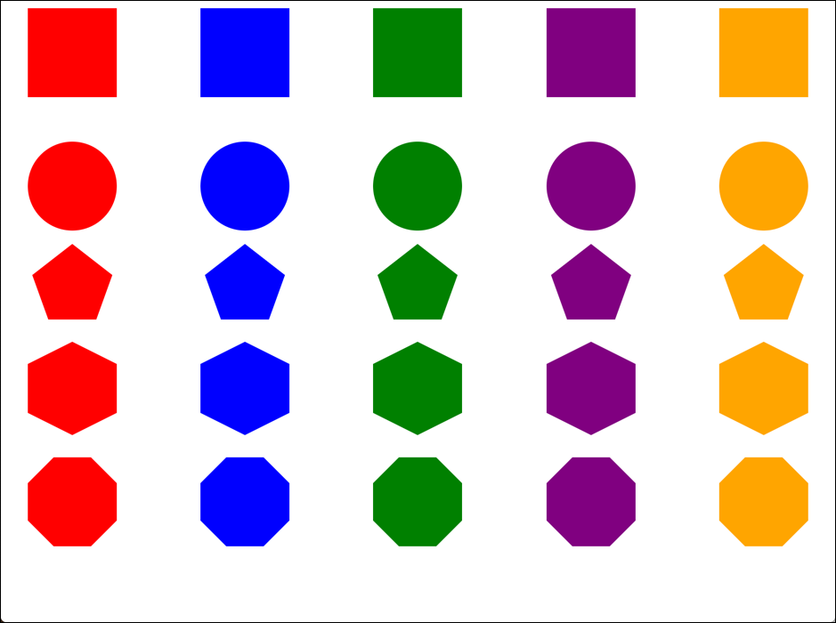

# Sassy Shapes 

## Objective
Create the necessary CSS and JavaScript to display five different shapes each in five different colors. Each shape / color combination will be represented by a class with the name *shape*-*color*. (ex. .square-red)

Sass will be used to generate all the necessary CSS. JavaScript will be used to generate the necessary HTML. 

## Requirements
The following requirements must be met in order to complete the assignment successfully:

1. Clone this repository from GitHub and use the provided files to complete the assignment. The repository contains the following files: `index.html`, `scss/style.scss`, and `js/script.js`. 
2. Complete the parts below.

**Part 1**
1. Use JavaScript and the provided arrays, to create and insert the HTML for all the shapes into the `<main>` element. The HTML should look like this:

```html
<main id="shapes" class="shapes">
  <div class="square-red"></div> 
  <div class="square-blue"></div> 
  <div class="square-green"></div> 
  <div class="square-purple"></div> 
  <div class="square-orange"></div> 
  <div class="circle-red"></div> 
  <div class="circle-blue"></div> 
  ...
  <div class="octagon-green"></div> 
  <div class="octagon-purple"></div> 
  <div class="octagon-orange"></div>
</main>
```

**Part 2**
1. Use Sass and the provided starter code to generate the necessary CSS to create each shape color combination. 
2. Create a Sass mixin that will accept a shape and color argument. The color argument should be optional.
3. The mixin should extend the shape placeholder that matches the provided shape.
4. Override the background color or border color with the provided color. Review the provided placeholder code to find the approach rules to override. The placeholder code uses the default color `red`. 
5. Use the colors and shapes lists to create a class for each shape and color combination. 
6. Each class should use the shapes mixin to generate the code for the appropriate shape and color. 

## Example
The screenshot below shows what the complete version should look like.



## Rubric

| Task | Points |
| ---  | :---:  | 
| Successfully creates the HTML using JavaScript | 2 |
| Successfully creates the shapes mixin | 5 |
| Successfully generates the shape / color classes | 3 |
| **Total** | **10** | 


## Submission
When the assignment is completed, follow the steps below to submit for grading:

1. Create a commit with the message "Completes the Sassy Shapes assignment"
2. Push all commits to GitHub.
3. Submit the URL to your GitHub repository to the **Sassy Shapes** assignment on BrightSpace.  
